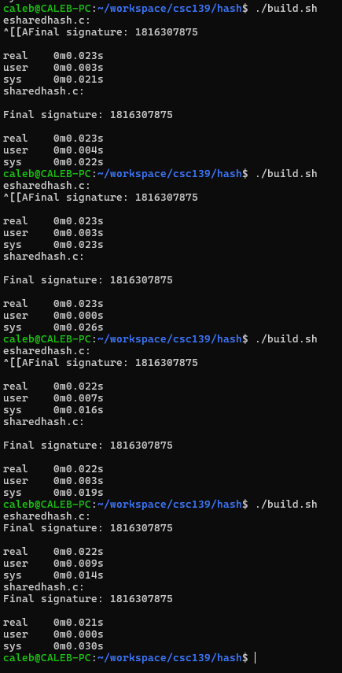

# Performance report

## Strategy of Choice
I chose to implement strategy A with thread pools because conceptually it made the most sense for me.
I'm currently attending CSC 163 which is all about concurrency in CUDA C on GPU architecture so thinking about splitting
up memory in that way isn't too far off from what I had to do in that class for some of my assignments.

## Timing data comparison

I tested extensively but the above image is a subset fairly representative of the data I saw
when running the program multiple times.

In table form:

| Run | sharedhash.c sys time | esharedhash.c sys time | Improvement (s) |
|-----|-----------------------|------------------------|-----------------|
| 0   | 0.022s                | 0.021s                 | 0.001s          |
| 1   | 0.026s                | 0.023s                 | 0.003s          |
| 2   | 0.019s                | 0.016s                 | 0.003s          |
| 3   | 0.030s                | 0.014s                 | 0.016s          |

I wrote a simple bash shell script that builds my `esharedhash.c` and `sharedhash.c` files,
and then runs them with the `time` command. You can see in this example that the `esharedhash.c`
was at worst only 0.001s faster than the `sharedhash.c` file when looking at the sys report.
However, the performance gains averaged around 0.003s and I saw at most a 0.016s improvement,
though this is certainly an outlier and not representative of the average.

## What I learned about concurrency
I learned that while locks are important for thread safety, I can utilize different strategies
to achieve the same goal. I also learned about direct memory management through this project.
I'm generally a comfortable C/C++ developer, but I've never written or worked with a custom allocator before, so this
was an interesting project to learn about, even though it was one of the most challenging I've had in my CS degree path.

## For fun: Valgrind results
