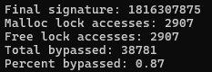
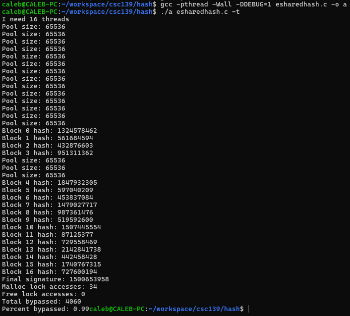
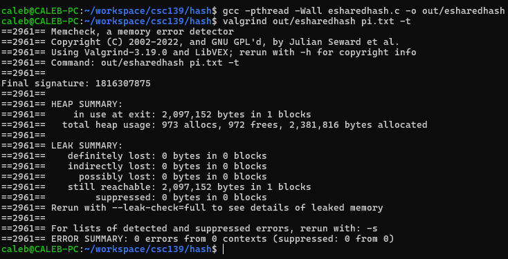

# Performance report

## Strategy of Choice
I chose to implement strategy A with per-thread memory pools because conceptually it made the most sense for me.
I'm currently attending CSC 163 which is all about concurrency in CUDA C on GPU architecture and I notice some similarities
with regular threaded programming using this pattern.
Each thread in this case gets it's own region of memory that's itself in a sectioned off part of the memory managed by a
simple bump pointer.

An important note is that I didn't use all 2mb of memory for the thread pools, but only 1mb.
This is because I was using umalloc() and ufree() to allocate the thread arguments and buffer, and also allowed
for some flexibility in how much memory each thread actually needed past what they were allowed initially to prevent wasting
too much memory. For small files I was encountering issues with this approach where I was getting only 26% of the malloc
lock contentions bypassed, but I was able to cut that down by using fseek() to find the end of the file and calculate the max number
of threads I will need to use. From there I scaled how much space was available in each thread's memory pool and saw a massive
improvement, jumping up to 99% lock acquisition avoidance rate for smaller files without a hit for bigger files.
Here's the debug output showing I was skipping lock acquisition 87% of the time on my 1mb file that you can see in the below image:

Demonstration of lock bypass rate for a small file comparatively:

## Timing data comparison

I tested extensively but the above image is a subset fairly representative of the data I saw
when running the program multiple times.

In table form:

| Run | sharedhash.c sys time | esharedhash.c sys time | Improvement (s) |
|-----|-----------------------|------------------------|-----------------|
| 0   | 0.022s                | 0.021s                 | 0.001s          |
| 1   | 0.026s                | 0.023s                 | 0.003s          |
| 2   | 0.019s                | 0.016s                 | 0.003s          |
| 3   | 0.030s                | 0.014s                 | 0.016s          |

I wrote a simple bash shell script that builds my `esharedhash.c` and `sharedhash.c` files,
and then runs them with the `time` command. You can see in this example that the `esharedhash.c`
was at worst only 0.001s faster than the `sharedhash.c` file when looking at the sys report.
However, the performance gains averaged around 0.003s and I saw at most a 0.016s improvement,
though this is certainly an outlier and not representative of the average.

## What I learned about concurrency
I learned that while locks are important for thread safety, I can utilize different strategies
to achieve the same goal. I also learned about direct memory management through this project.
I'm generally a comfortable C/C++ developer, but I've never written or worked with a custom allocator before, so this
was an interesting project to learn about, even though it was one of the most challenging I've had in my CS degree path.

## For fun: Valgrind results
